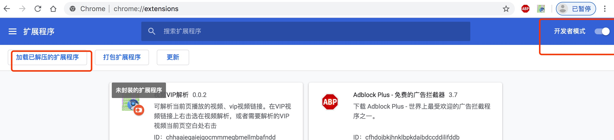
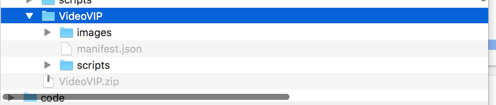

### 使用说明
#### 安装脚本
 * 将VideoVIP.zip下载到本地，解压。如果是Windows最好不好在桌面即可。
 * 打开chrome输入`chrome://extensions/`,打开开发者选项。点击`加载已解压的扩展程序`。
 

   找到刚刚解压出来的脚本目录，选择即可。

   

#### 如何使用脚本
* 打开常用的视频网站，找到你需要解析的VIP视频，有两种方式第一在视频链接上右击，第二在视频播放页面空白地方右击
简单说就是解析当前链接或者解析当前视频。

或

